## 项目简介

- 基于Vue的速达外卖平台（WebApp） 
- 包括用户、商家、商品、购物车等多个子模块
- 实现用户注册登录、商家商品关键字查询、商家店铺商品详评论详情显示、将商品加入购物车合计等多个功能 

## 主要技术

- Vue+Vue-router+Axios+MockJS 
- vue-lazyload+mint-ui+better-scroll+date-fns+swiper+vue-awesome-swpier

## 开发工具

VScode 

## 责任描述

- vue-router配置路由

- mock模拟接口数据

- axios发送http请求

- 获取数据渲染页面

- vuex实现对用户、商家、商品、购物车信息的状态管理 

## 实现功能

##### 页面展示

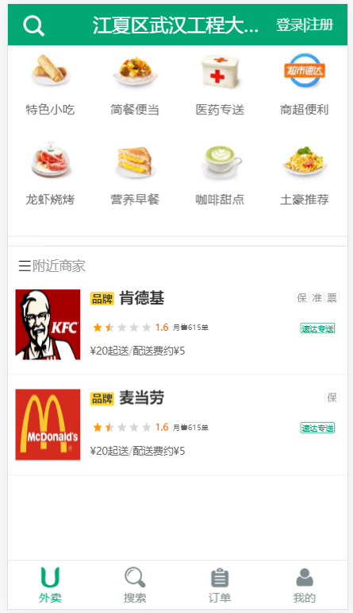
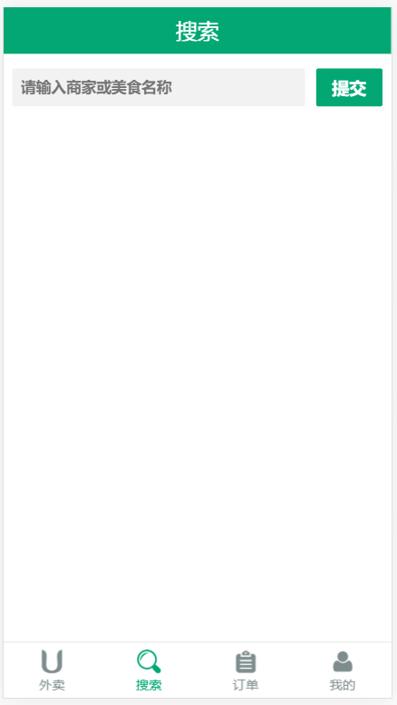
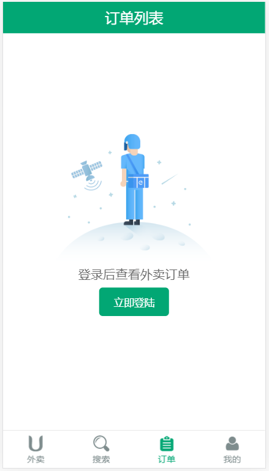
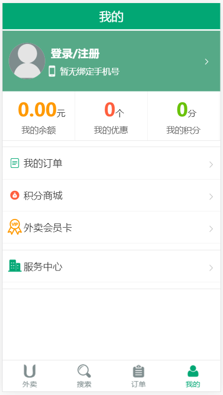
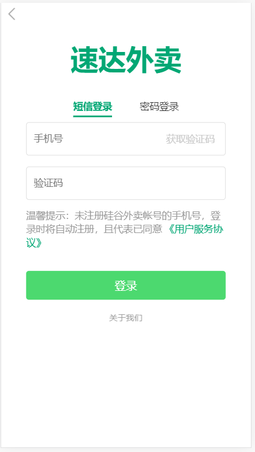
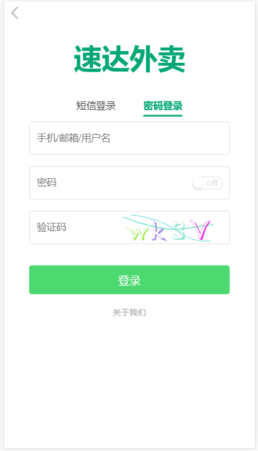

##### 展示附近店铺信息列表

##### 关键字查询店铺信息列表

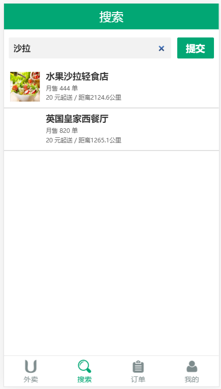

##### 用户手机或账号密码注册登录

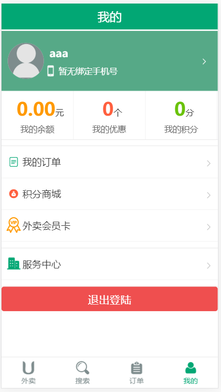
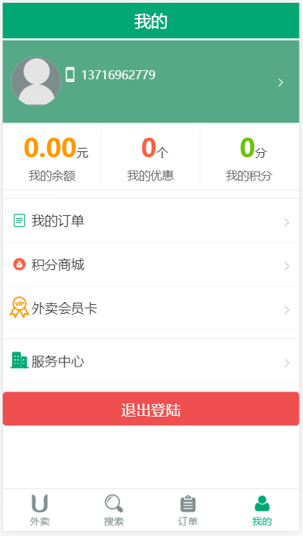

##### 商品详情、评价、商家详情信息列表

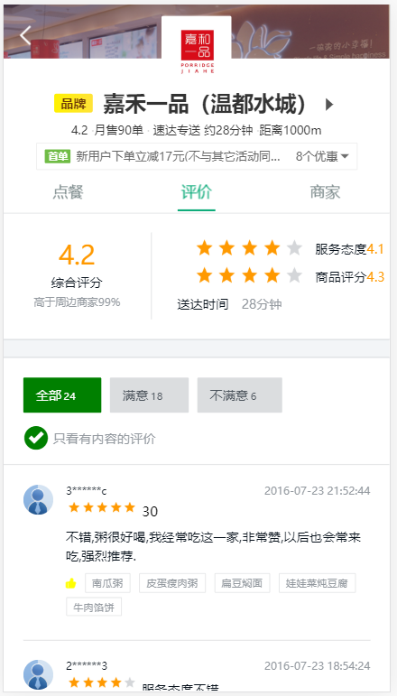
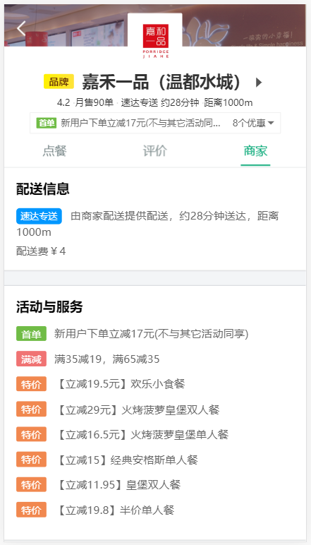

##### 购物车中商品信息、合计列表

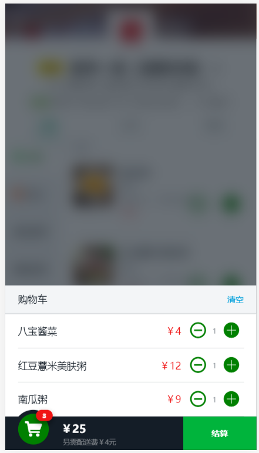
